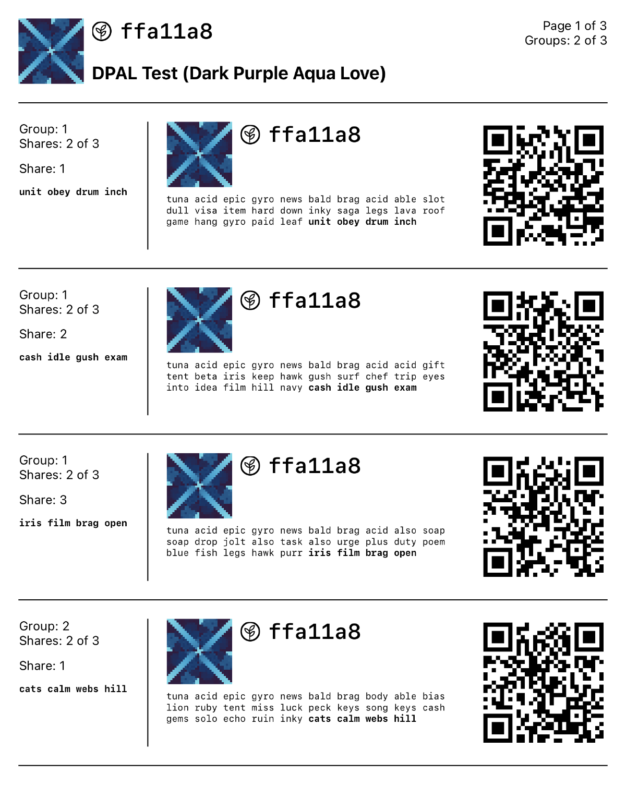
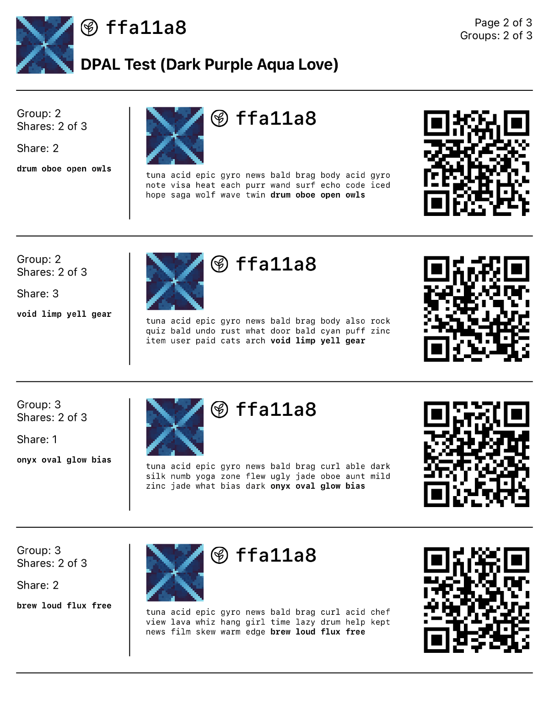

# SSKR Example & Test Vector

SSKR shards a seed to create shares that can then be distributed to other parties for later retrieval. The following example offers a test vector of a seed and shows its SSKR equivalents.

## 128-bit Seed

This example is built from the seed:
```
59f2293a5bce7d4de59e71b4207ac5d2
```
This seed can be stored in [Gordian SeedTool](https://github.com/BlockchainCommons/GordianSeedTool-iOS), which can reveal other info about the seed, such as how to back it up with either Blockchain Commons' [ByteWords](https://github.com/BlockchainCommons/bc-bytewords) or traditional BIP39 words:


The ByteWords for `59f2293a5bce7d4de59e71b4207ac5d2` are:
```
hawk whiz diet fact help taco kiwi gift view noon jugs 
quiz crux kiln silk tied omit keno lung jade
```
The BIP39 words are:
```
fly mule excess resource treat plunge nose soda reflect adult ramp planet
```
If you'd like to test the seed yourself, download [Gordian SeedTool for iOS](https://apps.apple.com/us/app/gordian-seed-tool/id1545088229) and click the "QR" icon at the top to scan a QR code. Point it to the QR code above and you'll load this Test Vector into your own phone!

### The SSKR

[SSKR](https://github.com/BlockchainCommons/bc-sskr) uses Shamir's Secret Sharing to shard a secret, such as the DPAL Test seed, so that the secret can be restored using some threshold of those secrets. 

#### Two-of-Three SSKR

A traditional use of Shamir's Secret Sharing might shard a secret into three shares, and then allow the secret to be restored from two of those shares. 

The following shows a set of 2-of-3 shares generated by Gordian SeedTool and exported as ByteWords:
```
tuna acid epic gyro jury jump able acid able flap rust king 
roof item vast real hang plus free menu good plus keno vast 
gray maze oval whiz tomb

tuna acid epic gyro jury jump able acid acid kiln main tuna 
keno able view plus gush body nail silk girl ruin visa curl 
yell loud rock jury fuel

tuna acid epic gyro jury jump able acid also exam high dark 
echo ruin wand lazy gray swan visa fish jazz logo gift kick
atom wall yank atom many
```
The following shows that same 2-of-3 share exported as a [Uniform Resource (UR)](https://github.com/BlockchainCommons/Research/blob/master/papers/bcr-2020-005-ur.md):
```
ur:crypto-sskr/gojyjpaeadaefprtkgrfimvtrlhgpsfemugdpskovtgybagtiomh
ur:crypto-sskr/gojyjpaeadadknmntakoaevwpsghbynlskglrnvaclylcmgdvyad
ur:crypto-sskr/gojyjpaeadaoemhhdkeornwdlygysnvafhjzlogtkkamkockmuso
```
A UR uses the minimal bytewords form, meaning that it shows only the first and last letter of each word. This means that "go" is "gyro", "jy" is "jury", "jp" is "jump", "ae" is "able", etc. You can see that the "UR" form of the three shares thus precisely matches the ByteWords except that the first three words, identifying it as an SSKR, has been omitted, and this changes the checksum, which is the last four words.

> :warning: **WARNING.** SSKR is non-deterministic. There is a random factor introduced when the shares are created, which means that every time you generate shares, they will be different. This is an expected and correct result.
  
#### The Two-of-Three Two-of-Three SSKR

One of the advantages of SSKR is that it can support arbitrary groups, where you can then reconstruct a secret by using some number of shares from some number of groups.

One example is a two-of-three two-of-three (grouped four-of-nine) SSKR. Three groups are created, each of which has three shares. Reconstructing the secret requires a threshold of two shares from a threshold of two groups. In other words, the secret can be reconstructed from four of the nine shares, provided that they are two each from two of the groups.

For a more complex SSKR such as this, you might want to use Gordian SeedTool's print function, rather than cutting and pasting SSKRs or URs:





## Final Notes

SSKR is a powerful way to back up digital secrets. This example demonstrates a specific seed and how it can be used to generate SSKR shares using two different groupings.

See [SSKR Cold Storage](sskr-cold-storage.md) for an example of how to store this test vector by etching it in metal. 


